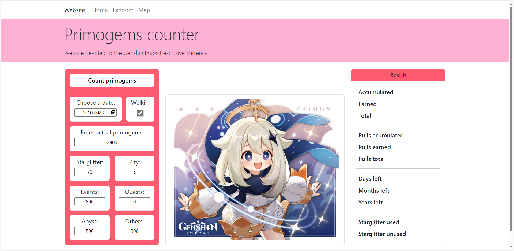

# primogems_counter_2023

## Overview
A web application dedicated to counting Genshin Impact's exclusive currency - primogems.

## Author:
- [@Ablesh1](https://github.com/Ablesh1)

## TechStack
Python, HTML, CSS, Bootstrap

## Development environment
### Requirements
- Python 3.10 or higher
### Environment setup

1. Download the project as .zip file from Git
2. Unzip the project file
3. Open the project location in terminal
```
cd path_to_project_location
```
4. Run the project
```
python manage.py runserver
```
5. Open the web application on localhost in the browser
```
http://127.0.0.1:8000/primogems/
```

## Screenshots


